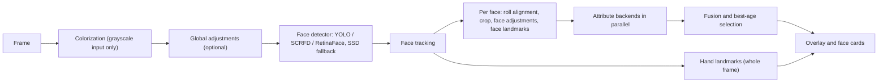

# Multimodal Face Analyzer

Real-time multi-model face analysis: 16 per-face and whole-frame features, four pluggable face
detectors, and benchmarked fusion across interchangeable backends.

[](https://github.com/dpologdvinity/multimodal-face-analyzer/actions/workflows/ci.yml)

[](LICENSE)

<!-- DEMO: record 5-10s of LIVE mode (age/gender/emotion/landmarks on, change expression once),
     export ≤5 MB, ~800px wide → docs/media/demo.gif; full-UI screenshot → docs/media/screenshot.png -->

A terminal-styled Streamlit app, with upload and live-webcam tabs, that detects faces in an uploaded image or webcam feed and runs any combination
of attribute models on each face: age, gender, race, emotion, gaze, liveness, recognition, and
more. Most features have two or more backends that can run side by side, and the app combines
their answers.

## Highlights

- **Interchangeable face detectors.** SSD, YOLOv8-Face, SCRFD, and RetinaFace share a common call
  shape in `src/detectors/`, selected per frame by a factory with SSD as the fallback.
- **Fusion across label taxonomies.** Gender, race, and emotion backends are combined by
  weighted mean, blend, or vote. Race and emotion labels are first mapped onto shared canonical
  classes (FairFace's East and Southeast Asian become one `Asian` class; `happy` and `happiness`
  are one vote).
- **Age fusion rejected on evidence.** Every age fusion rule tried scored at or below the best
  single model, so the app names its most reliable age model instead of averaging.
- **Concurrent, cached inference.** Per-face attribute models run in parallel on a thread pool,
  outputs are memoized on a hash of the exact model input, and LIVE mode shows FPS and
  per-model latency.
- **Build-time model selection, graceful runtime degradation.** Docker build arguments choose
  which weights and dependencies go into the image; at runtime any missing model is skipped and
  listed as unavailable rather than crashing the app.

## Architecture



Colorization runs in `src/app.py` (and in `src/ui/live.py` for live webcam frames) before
`analyze_frame()`; `src/pipeline/analyzer.py` orchestrates the remaining stages, which live in
`src/pipeline/stages.py`. Model loading is in `src/pipeline/loader.py`, fusion in `src/fusion/`,
and vendored third-party architectures in `src/nets/`.

## Results

Measured with `tools/benchmark.py` on 75 hand-labelled faces (detection recall 100%):

| Feature | Combined | Best single model | Weakest model |
| ------- | -------- | ----------------- | ------------- |
| Gender  | **100%** | `mivolo` 100% | `caffe` / `deepface` 86.7% |
| Emotion | **100%** | `dan` / `hsemotion` / `ferplus` 100% | `mini_xception` 95.2% |
| Race    | **96.0%** | `deepface` 94.7% | `fairface` 93.3% |
| Age     | **93.3%** (= `mivolo`) | `mivolo` 93.3% | `caffe` 62.7% |

These are small, in-sample numbers. The fusion weights are hand-set and were chosen on the same
75 faces they are scored on, with no held-out split; emotion labels are mostly `happy`, and age
ranges are hand estimates. The numbers were recorded before two later FairFace/DEX
preprocessing changes. A public held-out evaluation is planned. Method, full caveats, and
the fusion weights: [docs/benchmark.md](docs/benchmark.md).

## Quick start

Model weights are stored with [git-lfs](https://git-lfs.com/), which is required. The full set
is about 3.2 GB; `git lfs pull --include=...` fetches a subset (see [docs/setup.md](docs/setup.md)).

Native, with the guided installer (Debian/Ubuntu):

```bash
git lfs install
git clone https://github.com/dpologdvinity/multimodal-face-analyzer.git
cd multimodal-face-analyzer && git lfs pull
./install-and-run.sh          # pick backends, then open http://localhost:8501
```

Docker:

```bash
git lfs install
git clone https://github.com/dpologdvinity/multimodal-face-analyzer.git
cd multimodal-face-analyzer && git lfs pull
docker build -t face-analyzer .          # or ./build-and-run.sh for guided model selection
docker run -d -p 127.0.0.1:8501:8501 --name face_analyzer_container face-analyzer
```

The image runs `streamlit run src/app.py`. Build arguments, manual setup, and the remote-access
notes (the app has no authentication) are in [docs/setup.md](docs/setup.md).

## Features

| Feature | Backends | Notes |
| ------- | -------- | ----- |
| Face detection | `ssd` (required), `yolo`, `scrfd`, `retinaface` | One detector per frame |
| Age | `mivolo`, `fairface`, `dex`, `caffe` | Headline names the most reliable model present |
| Gender | `mivolo`, `fairface`, `caffe`, `deepface` | Fused |
| Race | `fairface`, `deepface` | Fused; close runner-up shown |
| Emotion | `hsemotion`, `dan`, `ferplus`, `mini_xception` | Fused vote over canonical labels |
| Gaze and head pose | `mediapipe` | Coarse direction, eye contact, yaw and pitch |
| Liveness | `mediapipe` + texture heuristic | Blink and replay cues; a screening signal only |
| Recognition | `vggface`, `lbph` | Against a gallery you enroll yourself |
| Glasses | `mobilenet` | |
| Mask | `mobilenetv2` | |
| Hair color | `colorimetric` | Heuristic, not a trained model |
| Eye color | `colorimetric` | Heuristic, not a trained model |
| Face landmarks | `mediapipe` | 468-point mesh |
| Hand landmarks | `mediapipe` | Whole frame, up to two hands |
| Colorization | `eccv16` | Whole frame, grayscale input only, before detection |
| Age progression | `franunet` | Non-commercial use only |
| 3D reconstruction | `deep3d` | **No working default weights**: needs the registration-gated Basel Face Model |

The 16 rows after face detection are the analysis features in the `Models` container
(`src/core/types.py`). Fifteen work with the weights in this repository; 3D reconstruction is
wired but stays unavailable until you supply the Basel Face Model file yourself.

The app also has tools that need no extra model: identity search against your own reference
photos, SAVE to a local SQLite database with eigenfaces matching, a scan that labels every face
recognized or unrecognized, an opt-in crowd count, image adjustment sliders, region
crop and transform, per-face image operations, and an opt-in voice and face arousal check in
LIVE mode. Per-model details: [docs/models.md](docs/models.md).

## Responsible use

- Predicted age, gender, race, and emotion are statistical guesses about how a face *appears*
  in one image. They are not a person's identity, and the app cannot know how anyone identifies.
- The categories are coarse and culturally contingent: a fixed list of six or seven race labels,
  binary gender, and a handful of emotion words do not describe real people well.
- The underlying models were trained on datasets (FairFace, AffectNet, IMDB-WIKI, VGGFace and
  others) with known demographic imbalances, so error rates differ across groups.
- Do not use this software to make decisions about individuals, such as hiring, policing,
  access control, credit, or surveillance.
- Run recognition and identity search only on people who have consented to it.

## Licensing

The code is MIT-licensed; see [LICENSE](LICENSE). Vendored architectures in `src/nets/` keep
their upstream licenses. The model weights are third-party files under their own terms, several
of them non-commercial or with no stated license; see [MODEL_LICENSES.md](MODEL_LICENSES.md).
